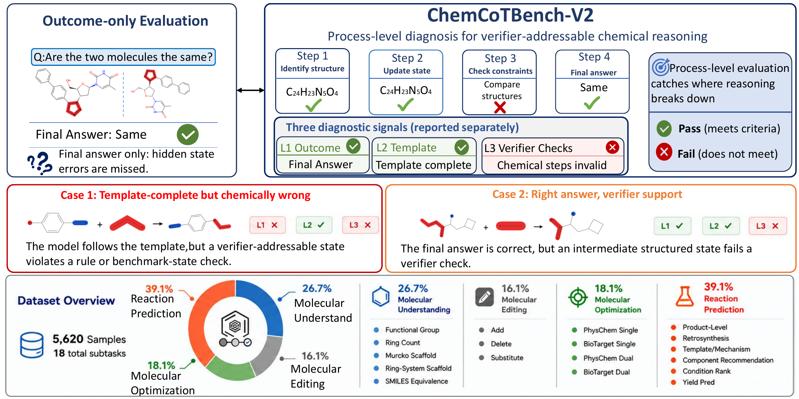
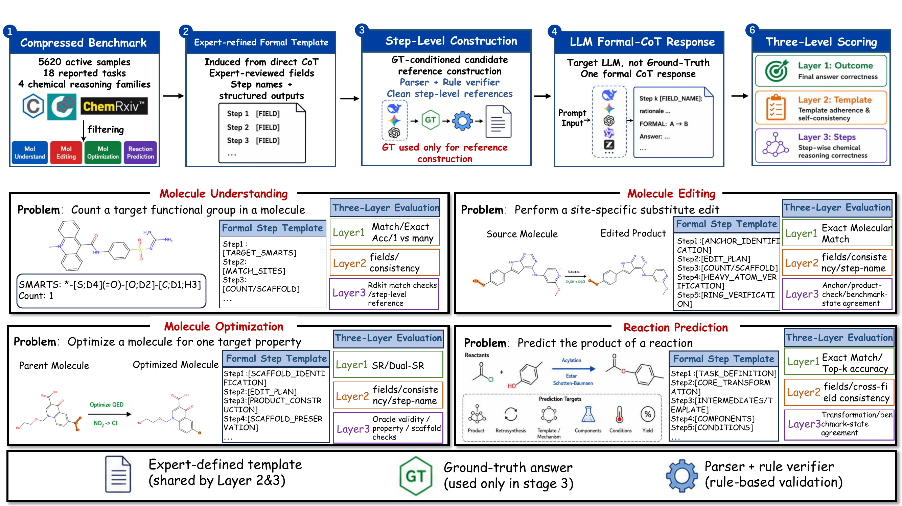

# ChemCoTBench-V2

**From Answers to States: Verifiable Process-Level Evaluation of Chemical Reasoning in Large Language Models**

<p align="center">
  <a href="#installation"></a>
  <a href="#license"></a>
  <a href="#data"></a>
</p>

ChemCoTBench-V2 is a rule-verifiable diagnostic benchmark for evaluating
structured chemical reasoning in large language models. Unlike outcome-only
benchmarks that score the final molecule, reaction product, ranking, or property
value, ChemCoTBench-V2 asks models to expose verifier-addressable intermediate
states and evaluates whether those states remain chemically consistent.

The benchmark covers **5,620 active evaluation samples**, **18 reporting tasks**,
and **31 fine-grained implementation subtasks** across four chemistry task
families: molecular understanding, molecule editing, molecular optimization, and
reaction prediction.

<p align="center">
  
</p>

## News

- **2026-06**: ChemCoTBench-V2 code release prepared for arXiv/GitHub.
- **2026-06**: Data released on [Hugging Face](https://huggingface.co/datasets/fresnellll/ChemCoTBench-V2).

## What Is Evaluated?

ChemCoTBench-V2 separates three signals that are often conflated in chemistry
benchmarks:

| Layer | Question | Examples of Checks |
| --- | --- | --- |
| **Layer 1: Outcome** | Is the final answer correct? | exact molecule/product match, ranking accuracy, yield MAE, optimization success |
| **Layer 2: Template adherence** | Did the model follow the requested formal reasoning template? | required steps, legal enum values, parseable structured fields, internal consistency |
| **Layer 3: Step validity** | Are the verifier-addressable chemical commitments correct? | RDKit scaffold checks, ring counts, atom accounting, product construction, condition-ranking consistency |

Layer 2 is deliberately not a chemistry-correctness score. It checks whether the
model followed the protocol. Layer 3 is where task-specific chemical verifiers
test the contents of the structured trace.

<p align="center">
  
</p>

## Benchmark Scope

| Family | Examples | Active Samples |
| --- | --- | ---: |
| **MolEdit** | add, delete, substitute reaction-derived molecular edits | 900 |
| **MolUnd** | functional groups, rings, scaffolds, SMILES equivalence | 1,500 |
| **RxnPred** | forward/byproduct/retro prediction, templates, mechanisms, components, condition ranking, yield | 2,200 |
| **MolOpt** | single- and dual-objective molecular optimization | 1,020 |

Paper-facing tables aggregate the 31 implementation subtasks into 18 reporting
tasks. This aggregation is presentation-level only; all models are evaluated on
the same 5,620 active records.

## Data

The benchmark data are released separately from this code repository. Place the
data package from [fresnellll/ChemCoTBench-V2](https://huggingface.co/datasets/fresnellll/ChemCoTBench-V2)
in one of these locations:

- set `CHEMCOT_DATA_DIR=/path/to/ChemCoTBench-V2-data`,
- place it as `../anonymous_data` next to this code directory, or
- place it as `./data` inside this repository.

The data package should contain the active benchmark records, aligned
formal-CoT/reference records, prompt templates, schemas, and split metadata. Bulk
upstream sources such as PubChem, ChEMBL, ZINC, USPTO/ORD, HTE supplements, and
TDC assets remain governed by their original licenses and are not mirrored in
this repository.

If starting from the ARR-style exported data directory, create the public
Hugging Face package with:

```bash
python scripts/prepare_hf_data_release.py \
  --source ../anonymous_data \
  --output ../hf_data_release \
  --force
```

This preserves the evaluator-required raw/process pairing and removes
difficulty labels plus internal patch/debug metadata that are not part of the
paper-facing benchmark.

## Repository Map

```text
baselines/cot_eval/              Minimal chemistry utility dependencies.
data_generation/                 Paper-aligned benchmark construction framework.
evaluation/                      Layer 1/2/3 evaluation framework.
formal_cot/                      Task prompts, parsers, and verifiers.
prm_generation/                  PRM/formal-CoT generation and verification.
prompts/                         Released formal templates and prompt docs.
scripts/                         Release validation and reporting helpers.
assets/                          README figures converted from the paper PDFs.
```

The `data_generation/` directory contains the main construction framework for
MolEdit, MolUnd, RxnPred, and MolOpt. Historical probes, one-off repair passes,
and difficulty-label tuning scripts are intentionally excluded from the release,
because the paper reports task-balanced benchmark construction rather than
difficulty-tagged evaluation.

## Installation

Use the released `chemcot` conda environment. RDKit installation is most reliable
through conda or mamba:

```bash
conda env create -f environment.yml
conda activate chemcot
```

If RDKit is already available in your environment, the lightweight pip
requirements are also provided:

```bash
pip install -r requirements.txt
```

## Quick Validation

After downloading the data package, run:

```bash
export CHEMCOT_DATA_DIR=/path/to/ChemCoTBench-V2-data
python scripts/validate_release.py --fast
```

This checks raw/process coverage, one-to-one ID alignment, parser readiness,
Layer 1, Layer 2, Layer 3 Type-I verifier flags, and 18-task reporting
aggregation.

To test the API-facing prompt and evaluation path without network calls:

```bash
python scripts/smoke_test_fake_api.py --n-samples 1
```

The fake-API test builds real evaluation prompts, returns the released reference
trace as a simulated model response, and then runs parsing plus Layer 1/2/3
Type-I checks.

## Run Evaluation

Run all active subtasks with an OpenAI-compatible API:

```bash
export CHEMCOT_DATA_DIR=/path/to/ChemCoTBench-V2-data
export OPENAI_API_KEY=...

python -m evaluation.run_all \
  --tasks mol_edit,mol_und,rxn_pred,mol_opt \
  --model MODEL_NAME \
  --base-url OPENAI_COMPATIBLE_BASE_URL \
  --api-key "$OPENAI_API_KEY" \
  --max-workers 4 \
  --sample-workers 1
```

The evaluation framework writes outputs to `results/evaluation/...` by default.
To redirect outputs:

```bash
export CHEMCOT_OUTPUT_DIR=/path/to/output-root
```

To recompute metrics from existing sampled outputs without API calls:

```bash
python -m evaluation.run_all \
  --tasks mol_edit,mol_und,rxn_pred,mol_opt \
  --model MODEL_NAME \
  --eval-only \
  --max-workers 4
```

`--eval-only` expects existing sampled outputs under
`$CHEMCOT_OUTPUT_DIR/evaluation/...` or `results/evaluation/...`.

## Data Generation

The released construction framework follows the paper-level pipeline:

```text
public / derived chemistry pools
  -> RDKit sanitization and canonicalization
  -> task-specific construction
  -> quality filtering and redundancy reduction
  -> task-balanced active benchmark records
  -> formal-CoT / reference-trace construction and verification
```

The family-specific scripts live under:

```text
data_generation/molecule_editing/
data_generation/molecule_understanding/
data_generation/reaction_prediction/
data_generation/molecular_optimization/
```

See [data_generation/README.md](data_generation/README.md) for command examples
and expected intermediate data boundaries.

## PRM / Formal-CoT Generation

The canonical prompt text and step names live under `formal_cot/`. To generate
or verify PRM-style data:

```bash
python -m prm_generation.generate_prm \
  --task mol_edit \
  --subtask add_v2 \
  --input-json /path/to/raw_outputs.json \
  --output-dir /path/to/output
```

If input records already contain `raw_output`, the script parses and verifies
without API calls. If `raw_output` is absent, pass `--model`, `--base-url`, and
an API key through `--api-key` or `OPENAI_API_KEY` to sample new formal-CoT
references.

## Citation

If you use ChemCoTBench-V2, please cite:

```bibtex
@misc{guo2026answers,
      title={From Answers to States: Verifiable Process-Level Evaluation of Chemical Reasoning in Large Language Models}, 
      author={Hongyu Guo and Hao Li and He Cao and Gongbo Zhang and Li Yuan},
      year={2026},
      eprint={2606.03660},
      archivePrefix={arXiv},
      primaryClass={cs.AI},
      url={https://arxiv.org/abs/2606.03660}
}
```

## License

The code is released under the MIT License. See [LICENSE](LICENSE).
